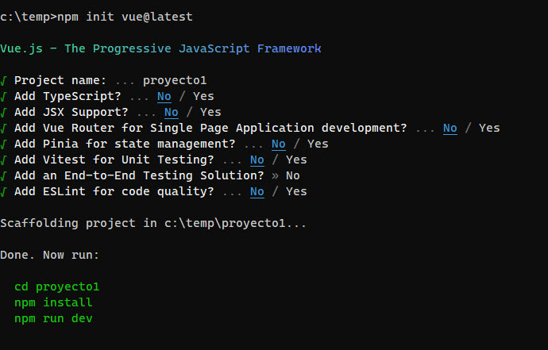

# vue0724

* Fue a la carpeta del proyecto en la consola
* En la carpeta del proyecto, ejecute lo siguiente:

```shell
npm init vue@latest
```
Y luego ingresar lo siguiente:
(cambiando el nombre del proyecto)


Una vez finalizado, ejecute lo siguiente:
```shell
  cd proyecto1
  npm install
  npm run dev
```
Esto va a instalar las librerias (se puede demorar un tiempo)
Y va ejecutar el codigo en modo de diseñador.
Una vez finalizado, abra la página web.

## Finalizar vue.
Para finalizar vue, presione control+c

## Una vez que el proyecto se ejecuto, abra la carpeta creada en visual studio code, y ahora puede comenzar a editarla.

Para volver a ejecutar la pagina, abra el terminal (dentro de Visual Studio Code), y ejecute

```shell
npm run dev
```

## carpetas
🗎 package.json (es el archivo de npm)   
🗎 index.html (la pagina inicial)    
🗎 vite.config.js (el archivo de configuracion de vite)   
📁 node_modules (donde se instalan las librerias, si esta carpeta no esta, ejecutar npm install)  
📁 public (donde estan los archivos a mostrar estaticos, tales como imagenes, estilos, etc.)  
📁 **src (esta es la carpeta donde agregamos nuestro codigo)**   
...... 🗎 main.js que indica que archivo se va a iniciar al comienzo (tambien se carga VueJS)
